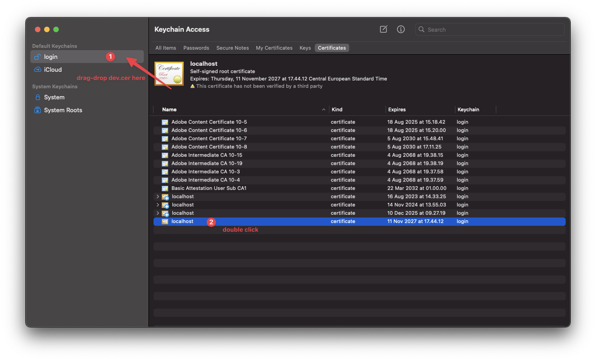

# .NET TLS Web Host Example

A minimal .NET 9 web API that serves HTTPS with a self-signed certificate.

Supports:

* **Docker**: mouts a single `dev.pfx` file and listens on <https://localhost:7077>
* **Local host**: runs Kestrel with the same `dev.pfx` file

This repo assumes the following layout:

```text
.
├─ docker-compose.yml
├─ .env                      # holds TLS_PASSWORD for Compose (optional)
└─ src/
   └─ tls-test.api/
      ├─ Dockerfile
      ├─ generate_certificate.sh
      ├─ certs/
      │  ├─ dev.pfx          # generated
      │  └─ dev.cer          # generated (public cert only)
      ├─ appsettings.Development.json
      └─ tls-test.api.csproj
```

## 1) Geneate the certificate (self-signed PFX)

macOS/Linux (bash):

```bash
# from the repository root
chmod +x ./src/tls-test.api/generate_certificate.sh
./src/tls-test.api/generate_certificate.sh localhost "Your Organization" "Development" "changeit"
```

This creates:

* `src/tls-test.api/certs/dev.pfx` (private key + certificate)
* `src/tls-test.api/certs/dev.cer` (public certificate for trusting)

> [!TIP]
> **Windows Users**: You can run the bash script via Git Bash/WSL.

## 2) Run with Docker

Ensure a `.env` file exists at the repository root (same folder as the `docker-compose.yml` file):

```text
TLS_PASSWORD=changeit
```

The `docker-compose.yml` file expects `dev.pfx` at `./src/tls-test.api/certs/dev.pfx` by default,
but can optionally be overriden to a different filename by appending `TLS_CERTIFICATE=custom-cert.pfx`
to the `.env` file (or by exporting it to your environment).

Start the container:

```bash
docker compose up -d --build
```

Open <https://localhost:7077>.

### Waht Docker Compose Does

* Maps host 7077 -> container 8443 (since it's a rootless container, the port must be > 1024).
* Mounts `./src/tls-test.api/certs` -> `/https` (read-only)
* Sets:
  * `ASPNETCORE_URLS=https://+:8443`
  * `ASPNETCORE_Kestrel__Certificates__Default__Path=/https/${TLS_CERTIFICATE:-dev.pfx}`
  * `ASPNETCORE_Kestrel__Certificates__Default__Pasasword=${TLS_PASSWORD}`

> [!NOTE]
> If you changed file names/paths, update the volume mount and environment variables according.

## 3) Run on the host machine (no Docker)

> [!IMPORTANT]
> If you already tried the Docker method, remember to run `docker compose down` as you will otherwise
> get port conflicts.

```bash
# from the repository root
dotnet run --project src/tls-test.api
```

Open <https://localhost:7077>.

## 4) Trust or accept the certificate in your browser

### A) Proceed with warning (quick & dirty)

You can click through the browser warning for self-signed certificates without installing
trust. In Chrome:

1. `Advanced`
2. `Proceed to localhost (unsafe)`


Which results in the browser saying "Not Secure", but you can access the website:


### B) Trust the certificate authority (CA)

The certificate generation script generated a public certificate that can be trusted
by the computer. We need to use the `dev.cer` file found under `./src/tls-test.api/certs/dev.cer`
and add it to our OS trust store.

* **Widows**
  1. Double-click `src/tls-test.api/certs/dev.cer` -> Open.
  2. Click **Install Certificate...** -> **Current User** -> **Place all certificates in the following store**.
  3. Choose **Trusted Root Certification Authorities** -> Finish -> restart your browser.
* **macOS**
  1. Open **Keychain Access** -> drag-drop `src/tls-test.api/certs/dev.der` into **login** keychain.
  2. Double-click the certificate -> **Trust** -> set **When using this certificate: Always Trust** -> close (enter password) -> restart browser.




Resulting in the red warning disappearing and looking just like any other regular HTTPS site (better for demos):


